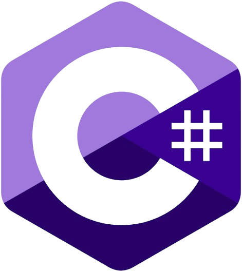

<h1 align="center">C# Fundamentals</h1>

  
  
  

C# is a modern programming language developed by Microsoft. Since its launch in the year 2000, it has gained popularity for its power and ease of use. This repository is a step-by-step guide to learning the fundamentals of C#, from variables to Object-Oriented Programming, with clear explanations and code examples in every topic.

## Menu

### Basic concepts

| # | Topic | Description |
|---|-------|-------------|
| 1 | [Introduction to C#](./README.md) | What C# is and why it matters |
| 2 | [Variables and data types](./01_basic_concepts/variables/01_basic.md) | Storing data: `int`, `string`, `bool`, `var`, `const` |
| 3 | [Console input and output](./01_basic_concepts/console/01_basic.md) | Interacting with the user through the terminal |
| 4 | [Strings](./01_basic_concepts/strings/01_basic.md) | Working with text |
| 5 | [String methods and properties](./01_basic_concepts/strings/02_string_methods_and_properties.md) | Transforming and inspecting text |
| 6 | [Numbers](./01_basic_concepts/numbers/01_basic.md) | Numeric types and conversions |
| 7 | [Math](./01_basic_concepts/numbers/02_math.md) | The `Math` class and its methods |
| 8 | [Operators](./01_basic_concepts/operators/01_basic.md) | Arithmetic, comparison, logical and more |
| 9 | [Conditionals](./01_basic_concepts/condicionals/01_basic.md) | Making decisions with `if` and `else` |
| 10 | [Switch](./01_basic_concepts/condicionals/02_switch.md) | Handling multiple cases |
| 11 | [Loops](./01_basic_concepts/loops/01_basic.md) | Repeating code with `for`, `while` and `foreach` |
| 12 | [Methods](./01_basic_concepts/methods/01_basic.md) | Reusing code with parameters and return values |
| 13 | [Exceptions](./01_basic_concepts/exceptions/01_basic.md) | Handling runtime errors with `try-catch` |

### Collections

| # | Topic | Description |
|---|-------|-------------|
| 1 | [Arrays](./02_Collections/arrays/01_basic.md) | Fixed-size collections of the same type |
| 2 | [Array methods and properties](./02_Collections/arrays/02_array_methods_and_properties.md) | Sorting, searching and more |
| 3 | [Lists](./02_Collections/lists/01_basic.md) | Dynamic collections with `List<T>` |
| 4 | [List methods and properties](./02_Collections/lists/02_list_methods_and_properties.md) | Adding, removing and finding elements |
| 5 | [LINQ](./02_Collections/linq/01_introduction.md) | Querying collections with expressive syntax |
| 6 | [LINQ methods](./02_Collections/linq/02_linq_methods.md) | `Where`, `Select`, `OrderBy` and more |

### OOP (Object-Oriented Programming)

| # | Topic | Description |
|---|-------|-------------|
| 1 | [Introduction](./03_oop/introduction/01_basic.md) | Classes, objects and the pillars of OOP |
| 2 | [Properties in classes](./03_oop/introduction/02_properties.md) | Encapsulating data with `get` and `set` |
| 3 | [Constructors](./03_oop/introduction/03_constructors.md) | Initializing objects |

## Importance in Software Development

### Versatility
C# is suitable for a wide range of applications, including desktop, web, and mobile applications, thanks to its integration with .NET Framework and .NET Core (.NET 6).

### Object-Oriented Approach
C# is an object-oriented language, facilitating the creation of modular and reusable software through the use of classes and objects.

### Security and Robustness
Designed with features like automatic memory management and exception handling to enhance code security and reliability.

### Productivity
Its intuitive syntax and tools like Visual Studio enable developers to write and maintain code efficiently.

### Ecosystem and Community
C# has a broad ecosystem of libraries and development tools, supported by an active community that provides support and additional resources.

## Author

**Javier Cómbita Téllez**

- GitHub: [jcomte23](https://github.com/jcomte23)
- LinkedIn: [Javier Cómbita Téllez](https://www.linkedin.com/in/javier-c%C3%B3mbita-t%C3%A9llez-4b4aa3258)
- Email: [jcomte23@outlook.com](mailto:jcomte23@outlook.com)

## License

This project is licensed under the [GNU General Public License v3.0](./LICENSE).
